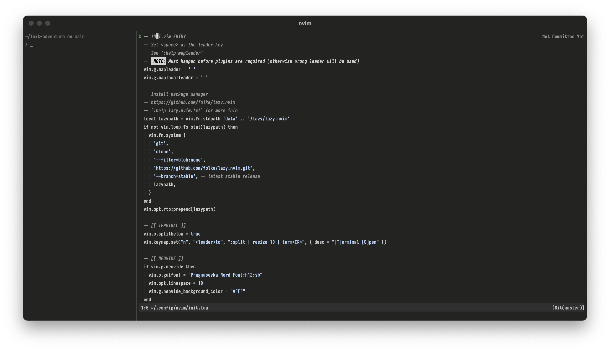

# DOTFILES 

## Preview

## Prerequisites

- fzf 
- Rust
- sqlite 
- [ripgrep](https://github.com/BurntSushi/ripgrep)
- fd 
- Neovim
- zsh

## VIM 
### Keybindings
Inspiration comes from Doom Emacs.

### Navigation
The idea is to rely on as much as possible on symbol-based navigation rather
than file-based navigation. That's why I do not make use of any file explorer
plugin. Instead, I make use of netrw, todo-comments, vim-bookmarks and Telescope for
navigation.

The aim is also to reduce noise, so I keep the statusline simple and use leap.vim to 
navigate instead of line numbers.

### Theme 
Vim-colors-plain + pragmasveka font.

